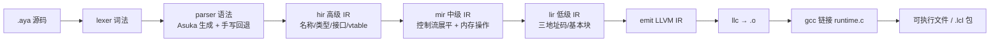
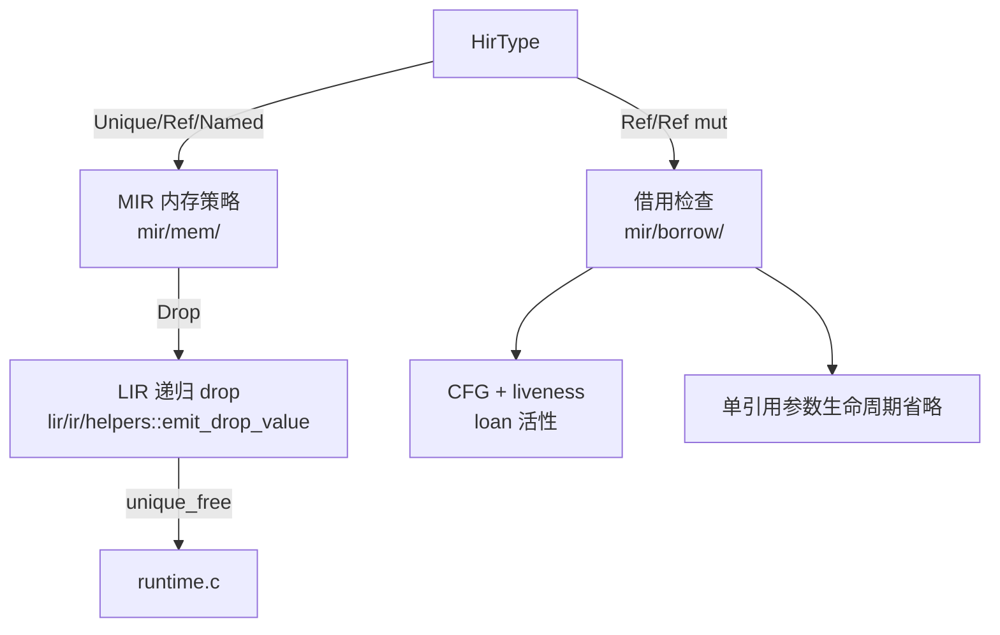
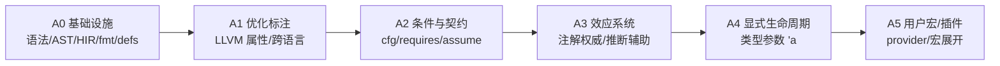
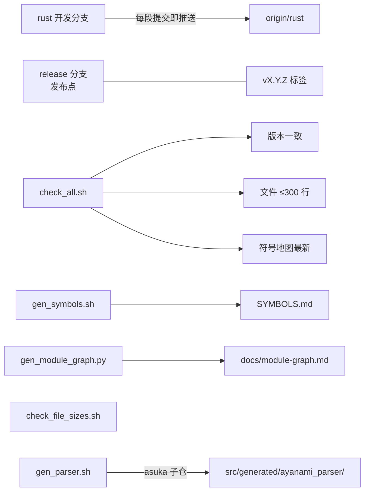

# Ayanami 知识图谱

> 用途：给人和 AI 一张"从概念到代码"的地图。先读这里，再按图索骥到文件；
> 精确定位符号仍用 `SYMBOLS.md` + `rg`。
>
> 维护规则：新增/移动子系统、语义或路线阶段时更新本文件；模块依赖图由脚本生成。

## 0. 文档地图

| 文档 | 内容 |
|---|---|
| `AGENTS.md` | AI 协作入口：命令、陷阱、约定、分支/版本规则 |
| `docs/knowledge-graph.md` | 本文件：概念与代码的映射 |
| `docs/module-graph.md` | 生成物：顶层模块依赖图（Mermaid） |
| `docs/annotations.md` | 标注系统（标注式编程）设计：A0–A5 路线 |
| `README.md` | 语言与 CLI 用户手册 |
| `SYMBOLS.md` | 生成物：符号地图（路径:行号:签名） |

## 1. 编译管线（主图）



| 阶段 | 位置 | 关键入口 |
|---|---|---|
| CLI | `src/main.rs`、`src/cli/` | `cmd_*` |
| 词法 | `src/lexer/` | `Lexer::tokenize_all` |
| 语法 | `src/parser/` | `parse_source`、`gen_bridge::node_to_program` |
| 文法 | `ayanami.grammar` + `asuka/`（子仓） | `./gen_parser.sh` |
| HIR | `src/hir/lower/` | `lower_program`、`to_mir.rs` |
| MIR | `src/mir/lower/` | `lower_program`、`mem/`、`borrow/` |
| LIR | `src/lir/lower/`、`src/lir/emit/` | `lower_program`、`emit_program` |
| 序列化 | `src/lir/serialize/` | `.lcl` payload |
| 管线编排 | `src/compiler/` | `CompilerPipeline`、`compile_file` |
| 驱动 | `src/driver/` | `ir_to_object`、`objects_to_exe` |
| 包 | `src/package/` | `Package`、`load_package` |
| 格式化 | `src/formatter/` | `format_file` |
| 驻留/位置/错误 | `src/intern/`、`src/span.rs`、`src/error.rs` | `Symbol`、`Span`、`Error` |

## 2. 所有权与借用子系统



| 概念 | 实现位置 | 说明 |
|---|---|---|
| 默认移动 / Copy | `hir/ty.rs::is_copy`、`helpers/wrap.rs` | 非 Copy 赋值/传参移动；use-after-move 报错 |
| `unique` | `mir/mem/drop.rs`、`lir/ir/helpers.rs` | 独占堆指针，递归释放；Copy 类型零开销 |
| `ref` / `ref mut` | `mir/borrow/` | NLL：最后一次使用后失效；可存局部变量、可返回（单引用参数省略） |
| 两阶段借用 | `mir/borrow/loans.rs` | 接收者位置可变借用先 reserved（`s.add(s.v)`） |
| 接口胖指针 | `hir/ty.rs::FatPtr`、`lir/ir/nodes_b.rs::MakeFatPtr` | `ref Shape` 借用 / `unique Shape` 拥有 |
| 内存运行时 | `src/runtime.c` | `unique_alloc/free` + 存活计数（无 RC/GC） |

## 3. 标注系统路线（设计见 `docs/annotations.md`）



| 实体 | 位置 | 状态 |
|---|---|---|
| `#[...]` 语法/AST | `ayanami.grammar`、`parser/parser/core.rs`、`parser/ast` | A0 已完成 |
| 属性注册表/校验 | `hir/attrs` | A0 已完成 |
| 标注携带（MIR/LIR/包） | `mir/ir.rs`、`lir/ir/nodes_d.rs`（`LirAttr`/`ExternDecl`）、`lir/serialize` | A1 已完成 |
| LLVM 属性映射 | `lir/emit/functions.rs`（`llvm_attr_suffix`/`llvm_param_attrs`）、`lir/emit/mod.rs` | A1 函数级+形参级已完成 |
| extern 真实签名 | `lir/lower/mod.rs`（`extern_decls`） | A1 已完成 |
| cfg 条件裁剪 | `hir/cfg.rs`、`package/symbols.rs` | A2b 已完成（A2f 起含语句级） |
| 契约标注（assume/requires/ensures/invariant） | `hir/contracts.rs`、`hir/lower/body/ensure.rs`、`HirStmt::{Assume,Contract}` → `SMir*` → `SLir*`、`runtime.c` | A2c/A2d/A2e/A2f 已完成 |
| 标注 provider/宏 | `parser`（AttrPath）、`hir/attrs.rs`（Imports 解析）；计划 `.lcl` 宏表、`target/macros/*.so` | A5a 已完成，A5b 待做 |
| 效应系统 | `hir/effects/{mod,infer,scan}.rs`（注解/推断/定位）、`LirEffects` 自动属性 | A3a/A3b 已完成 |
| 生命周期参数 | 类型系统 + `mir/borrow/` | 未实现 |

## 4. 工具与流程



| 脚本 | 作用 |
|---|---|
| `scripts/check_all.sh` | 版本 + 文件行数 + 符号地图三项检查 |
| `scripts/gen_symbols.sh` | 生成/校验 `SYMBOLS.md` |
| `scripts/gen_module_graph.py` | 生成本文件同目录的 `module-graph.md` |
| `scripts/check_version.sh` | Cargo/插件/std/标签版本一致 |
| `scripts/check_file_sizes.sh` | 单文件 ≤300 行 |
| `scripts/split_generated_parser.py` | 拆分 asuka 生成的解析器 |
| `gen_parser.sh` | 从子仓 asuka 重新生成解析器并拆分 |

## 5. 常用查询

```bash
rg "关键词" SYMBOLS.md          # 符号 → 文件:行号:签名
rg "use crate::mir" src         # 反向依赖
python3 scripts/gen_module_graph.py   # 刷新模块依赖图
rg -n "TODO|FIXME" src docs     # 待办
```

## 6. 关系索引（压缩版）

- 管线：`lexer → parser → hir → mir → lir → emit → opt -O2(可选) → llc → gcc`
- 所有权：`HirType::Unique/Ref` —实现于→ `mir/mem` —检查于→ `mir/borrow` —发射于→ `lir/ir` —运行于→ `runtime.c`
- 文法：`ayanami.grammar` —生成→ `src/generated/ayanami_parser` —桥接→ `parser/gen_bridge`
- 包：`hir` —序列化→ `lir/serialize` —封装→ `package` —导入→ `compiler/import`
- 工具链：`check_all` ⊃ `check_version` + `check_file_sizes` + `gen_symbols --check`
- 标注：`#[...]` —校验→ `hir/attrs` —携带→ MIR/LIR(`LirAttr`/`ExternDecl`) —映射→ LLVM 属性（A1 函数级）—计划→ 效应（A3）/生命周期（A4）
