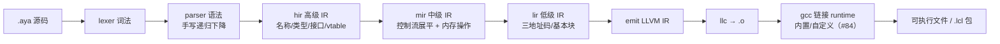
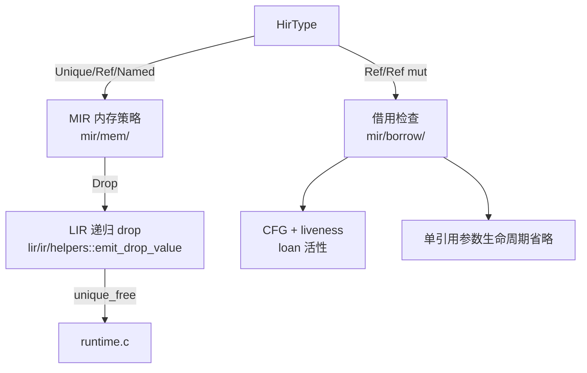
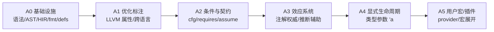
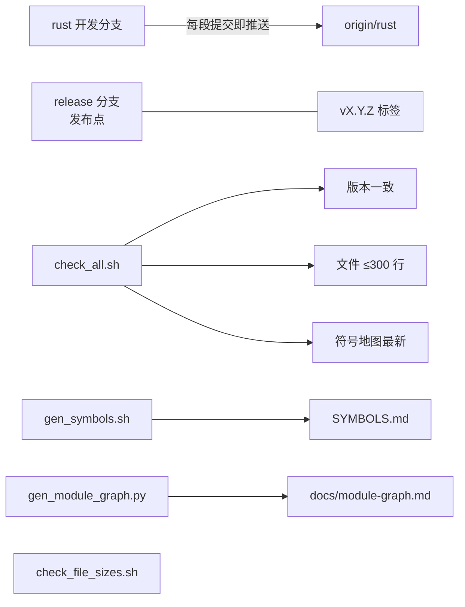

# Ayanami 知识图谱

> 用途：给人和 AI 一张"从概念到代码"的地图。先读这里，再按图索骥到文件；
> 精确定位符号仍用 `SYMBOLS.md` + `rg`。
>
> 维护规则：新增/移动子系统、语义或路线阶段时更新本文件；模块依赖图由脚本生成。

## 0. 文档地图

| 文档 | 内容 |
|---|---|
| `AGENTS.md` | AI 协作入口：命令、陷阱、约定、分支/版本规则 |
| `docs/knowledge-graph.md` | 本文件：概念与代码的映射 |
| `docs/module-graph.md` | 生成物：顶层模块依赖图（Mermaid） |
| `docs/annotations.md` | 标注系统（标注式编程）设计：A0–A5 路线 |
| `docs/generic-monomorphization.md` | 泛型结构体/枚举单态化（最小实现完成） |
| `docs/lifetimes.md` | 注解式生命周期 `#[follow_with]` 设计（A4） |
| `docs/int-types.md` | 定宽整数类型（M1.1 核心完成）：集合/字面量适配/语义/实现位置 |
| `docs/c-interop.md` | C 互操作（`#[export]`）与 runtime 选择（`[runtime] path`/`AYANAMI_RUNTIME`，已实现） |
| `docs/typeclass.md` | typeclass/`Self`/关联类型设计（T1 已实现，其余评估关闭） |
| `docs/const-globals.md` | const / static / 编译期求值设计（M6.1 已实现） |
| `README.md` | 语言与 CLI 用户手册 |
| `SYMBOLS.md` | 生成物：符号地图（路径:行号:签名） |

## 1. 编译管线（主图）



| 阶段 | 位置 | 关键入口 |
|---|---|---|
| CLI | `src/main.rs`、`src/cli/` | `cmd_*` |
| 词法 | `src/lexer/` | `Lexer::tokenize_all` |
| 语法 | `src/parser/` | `parse_source`、手写解析器 `parser/` |
| HIR | `src/hir/lower/` | `lower_program`、`to_mir.rs` |
| MIR | `src/mir/lower/` | `lower_program`、`mem/`、`borrow/` |
| LIR | `src/lir/lower/`、`src/lir/emit/` | `lower_program`、`emit_program` |
| 序列化 | `src/lir/serialize/` | `.lcl` payload |
| 管线编排 | `src/compiler/` | `CompilerPipeline`、`compile_file` |
| 驱动 | `src/driver/` | `ir_to_object`、`objects_to_exe` |
| 包 | `src/package/` | `Package`、`load_package` |
| 格式化 | `src/formatter/` | `format_file` |
| 驻留/位置/错误 | `src/intern/`、`src/span.rs`、`src/error.rs` | `Symbol`、`Span`、`Error` |

## 2. 所有权与借用子系统



| 概念 | 实现位置 | 说明 |
|---|---|---|
| 默认移动 / Copy | `hir/ty.rs::is_copy`、`helpers/wrap.rs` | 非 Copy 赋值/传参移动；use-after-move 报错 |
| 拥有堆值（内部 `HirType::Unique`） | `mir/mem/drop.rs`、`lir/ir/helpers.rs` | `[T]`/`[T; n]` 与拥有胖指针；递归释放；Copy 类型零开销（用户语法无 `unique`） |
| 数组元素布局 | `lir/ir/helpers.rs::elem_layout_size` | 分配大小按 LLVM 布局递归计算（结构体/枚举含对齐填充） |
| `ref` / `ref mut` | `mir/borrow/` | NLL：最后一次使用后失效；可存局部变量、可返回（单引用参数省略） |
| ref 自动解引用 | `hir/mod.rs::SDeref`、`hir/stmt.rs::DerefAssign` | 值上下文自动 load；`ref mut` 赋值穿透 store（LIR 复用 index-0 指针解引用） |
| 两阶段借用 | `mir/borrow/loans.rs` | 接收者位置可变借用先 reserved（`s.add(s.v)`） |
| 接口胖指针 | `hir/ty.rs::FatPtr`、`lir/ir/nodes_b.rs::MakeFatPtr` | `ref Shape` 借用 / `Shape` 拥有 |
| 内存运行时 | `src/runtime.c` | `unique_alloc/free` + 存活计数（无 RC/GC） |

## 3. 标注系统路线（设计见 `docs/annotations.md`）



| 实体 | 位置 | 状态 |
|---|---|---|
| `#[...]` 语法/AST | `parser/parser/core.rs`、`parser/ast` | A0 已完成 |
| 属性注册表/校验 | `hir/attrs` | A0 已完成 |
| 标注携带（MIR/LIR/包） | `mir/ir.rs`、`lir/ir/nodes_d.rs`（`LirAttr`/`ExternDecl`）、`lir/serialize` | A1 已完成 |
| LLVM 属性映射 | `lir/emit/functions.rs`（`llvm_attr_suffix`/`llvm_param_attrs`）、`lir/emit/mod.rs` | A1 函数级+形参级已完成 |
| extern 真实签名 | `lir/lower/mod.rs`（`extern_decls`） | A1 已完成 |
| cfg 条件裁剪 | `hir/cfg.rs`、`package/symbols.rs` | A2b 已完成（A2f 起含语句级） |
| 契约标注（assume/requires/ensures/invariant） | `hir/contracts.rs`、`hir/lower/body/ensure.rs`、`HirStmt::{Assume,Contract}` → `SMir*` → `SLir*`、`runtime.c` | A2c/A2d/A2e/A2f 已完成 |
| 标注 provider/宏 | `parser`（AttrPath）、`hir/attrs*.rs`（Imports/注解校验）、`.lcl` 宏/pass/依赖表、`compiler/macro_expand/{mod,plugin,pass_plugin}.rs`（.so + dlopen）、`compiler/build/passes.rs` + `std/mir.aya`（MIR pass，A5d-2） | A5a–A5d-2 已完成（MVP） |
| 效应系统 | `hir/effects/{mod,infer,diag,scan}.rs`（注册表/推断/诊断）、`LirEffects` 自动属性、`.lcl` 效应 tokens（声明+推断+承诺） | A3 重构完成（Stage 1–3） |
| 错误传播 `?` | `hir/lower/body/expr_ops1.rs`（pending 语句内联 + 早退）、`ctx.{variant_payload_type,instantiate_*}` | A3d 已完成（含泛型 Result 最小单态化） |
| 生命周期 `#[follow_with]` | 计划：字段属性文法 + `mir/borrow/` 来源标记 | A4 设计（docs/lifetimes.md） |

## 4. 工具与流程



| 脚本 | 作用 |
|---|---|
| `scripts/check_all.sh` | 版本 + 行数 + 符号地图 + 零告警 + 语言回归 + IR 快照 |
| `scripts/gen_symbols.sh` | 生成/校验 `SYMBOLS.md` |
| `scripts/gen_module_graph.py` | 生成本文件同目录的 `module-graph.md` |
| `scripts/check_version.sh` | Cargo/插件/std/标签版本一致 |
| `scripts/check_file_sizes.sh` | 单文件 ≤300 行 |

## 5. 常用查询

```bash
rg "关键词" SYMBOLS.md          # 符号 → 文件:行号:签名
rg "use crate::mir" src         # 反向依赖
python3 scripts/gen_module_graph.py   # 刷新模块依赖图
rg -n "TODO|FIXME" src docs     # 待办
```

## 6. C 互操作、runtime 与 typeclass（#84）

| 概念 | 实现/设计位置 | 说明 |
|---|---|---|
| `#[export]` / `extern "C"` 定义 | `hir/attrs.rs`、`hir/lower/body/lower_items.rs`、`mir/lower/functions.rs`、`lir/lower/names.rs` | 导出 C 符号（原始名）；空体 = 外部声明 |
| 自定义 runtime | `package/config.rs`、`driver/runtime.rs`、`driver/mod.rs` | `[runtime] path` / `AYANAMI_RUNTIME`；.c/.a/.o 替代内置 runtime.c |
| 回归夹具 | `tests/c_export/`、`tests/runtime_custom/` | C harness 互操作 + runtime 选择三路径 |
| typeclass/`Self` | `docs/typeclass.md`、`hir/lower/body/iface_match.rs`、`parser/self_type.rs` | T1 已实现（签名 Self 消解 + 对象安全诊断）；T2–T5 评估关闭；参数化接口约束可用（违例检查已修复） |

## 7. 关系索引（压缩版）

- 管线：`lexer → parser → hir → mir → lir → emit → opt -O2(可选) → llc → gcc`
- 所有权：`HirType::Unique/Ref` —实现于→ `mir/mem` —检查于→ `mir/borrow` —发射于→ `lir/ir` —运行于→ `runtime.c`
- 语法：手写递归下降 `src/parser/parser/` —AST→ `src/parser/ast`（唯一解析路径）
- 包：`hir` —序列化→ `lir/serialize` —封装→ `package` —导入→ `compiler/import`
- 工具链：`check_all` ⊃ `check_version` + `check_file_sizes` + `gen_symbols --check` + `check_warnings` + `regression` + `ir_snapshot`
- 标注：`#[...]` —校验→ `hir/attrs` —携带→ MIR/LIR(`LirAttr`/`ExternDecl`) —映射→ LLVM 属性（A1 函数级）—计划→ 效应（A3）/生命周期（A4）
- 泛型/内联：定义以**源码**随 `.lcl` 导出（`source=`）→ 导入方本地重新实例化 → 发射 `linkonce_odr` 弱链接去重（#100 设计）
- 定宽整数：`i8..i128/u8..u128/isize/usize` —解析→ `fixed_width_int` —HIR→→ `HirType::IntN` —字面量适配→ `as_int_literal`/`retype_int_literal` —发射→ `iN` 算术/`icmp`（按 signed）
- C 导出：`#[export]`/`extern "C"` 定义 —校验→ `hir/attrs` —HIR→ `extern_c` —MIR/LIR→ 保留函数体 —发射→ 原始符号名（默认可见）
- runtime：`AYANAMI_RUNTIME`/`[runtime] path` —解析→ `driver/runtime.rs` —链接→ `objects_to_exe_with_runtime`（.c/.a/.o 替代内置 runtime.c）
- const：`const NAME = expr` —解析→ `Stmt::ConstDecl` —求值→ `hir/lower/body/const_eval.rs` —替换→ `expr_lower.rs`（Ident → `SConst`）—用途→ 数组大小（`ArraySized`）
- 位运算：`& | ^ << >> ~` —文法→ operator（prec 6–9 / 前缀）—HIR→ `lower_binary`/`lower_unary` —发射→ `and/or/xor/shl/ashr/lshr` —折叠→ `example/constfold_lib.aya`
- 显式转换：`expr as T` —解析→ `parse_cast` / 运算符表 prec:12 —HIR→ `lower_cast`/`SCast` —发射→ `sext/zext/trunc/sitofp/uitofp/fptosi.sat/fptoui.sat`
