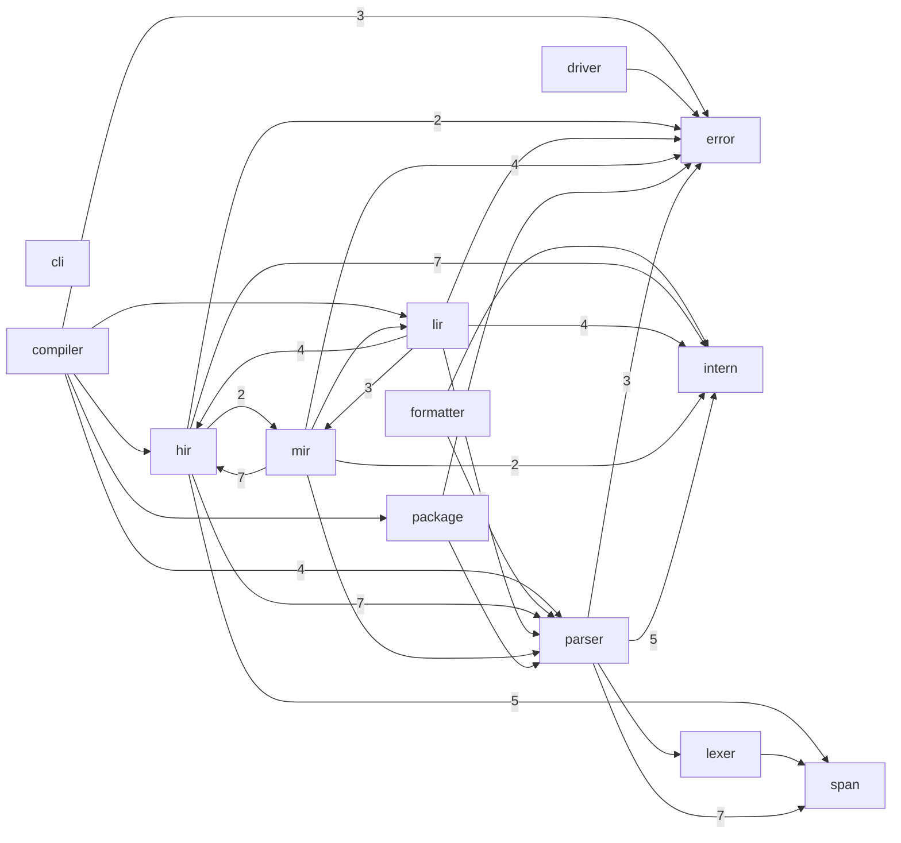

# 模块依赖图（知识图谱 · 生成物）

> 由 `python3 scripts/gen_module_graph.py` 生成，请勿手改。
> 节点为顶层模块，边为 `use crate::...` 引用（排除 `src/generated/`）。

## 边统计

| 来源 | 目标 | 引用数 |
| --- | --- | ---: |
| `hir` | `intern` | 7 |
| `hir` | `parser` | 7 |
| `mir` | `hir` | 7 |
| `parser` | `span` | 7 |
| `hir` | `span` | 5 |
| `parser` | `intern` | 5 |
| `compiler` | `parser` | 4 |
| `lir` | `hir` | 4 |
| `lir` | `intern` | 4 |
| `mir` | `error` | 4 |
| `compiler` | `error` | 3 |
| `lir` | `mir` | 3 |
| `lir` | `parser` | 3 |
| `parser` | `error` | 3 |
| `hir` | `error` | 2 |
| `hir` | `mir` | 2 |
| `mir` | `intern` | 2 |
| `compiler` | `hir` | 1 |
| `compiler` | `lir` | 1 |
| `compiler` | `package` | 1 |
| `driver` | `error` | 1 |
| `formatter` | `intern` | 1 |
| `formatter` | `parser` | 1 |
| `lexer` | `span` | 1 |
| `lir` | `error` | 1 |
| `mir` | `lir` | 1 |
| `mir` | `parser` | 1 |
| `package` | `error` | 1 |
| `package` | `parser` | 1 |
| `parser` | `lexer` | 1 |

共 14 个顶层模块、30 条依赖边。
