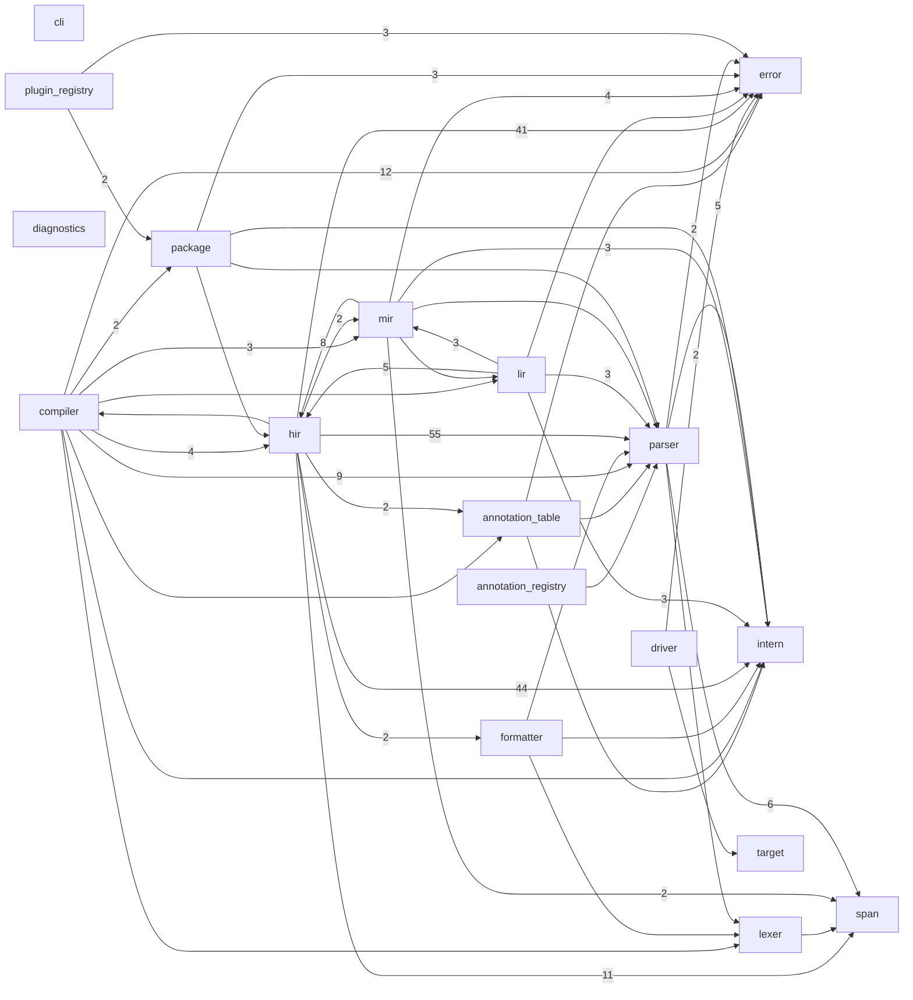

# 模块依赖图（知识图谱 · 生成物）

> 由 `python3 scripts/gen_module_graph.py` 生成，请勿手改。
> 节点为顶层模块，边为 `use crate::...` 引用。

```mermaid
graph LR
    annotation_registry
    annotation_table
    cli
    compiler
    diagnostics
    driver
    error
    formatter
    hir
    intern
    lexer
    lir
    mir
    package
    parser
    plugin_registry
    span
    target
    annotation_registry --> parser
    annotation_table --> error
    annotation_table --> intern
    annotation_table --> parser
    compiler --> annotation_table
    compiler -->|12| error
    compiler -->|4| hir
    compiler --> intern
    compiler --> lexer
    compiler --> lir
    compiler -->|3| mir
    compiler -->|2| package
    compiler -->|9| parser
    driver -->|2| error
    driver --> target
    formatter --> intern
    formatter --> lexer
    formatter -->|2| parser
    hir -->|2| annotation_table
    hir --> compiler
    hir -->|41| error
    hir -->|2| formatter
    hir -->|44| intern
    hir -->|2| mir
    hir -->|55| parser
    hir -->|11| span
    lexer --> span
    lir --> error
    lir -->|5| hir
    lir -->|3| intern
    lir -->|3| mir
    lir -->|3| parser
    mir -->|4| error
    mir -->|8| hir
    mir -->|3| intern
    mir --> lir
    mir --> parser
    mir -->|2| span
    package -->|3| error
    package --> hir
    package --> intern
    package --> parser
    parser -->|2| error
    parser -->|5| intern
    parser --> lexer
    parser -->|6| span
    plugin_registry -->|3| error
    plugin_registry -->|2| package
```

## 边统计

| 来源 | 目标 | 引用数 |
| --- | --- | ---: |
| `hir` | `parser` | 55 |
| `hir` | `intern` | 44 |
| `hir` | `error` | 41 |
| `compiler` | `error` | 12 |
| `hir` | `span` | 11 |
| `compiler` | `parser` | 9 |
| `mir` | `hir` | 8 |
| `parser` | `span` | 6 |
| `lir` | `hir` | 5 |
| `parser` | `intern` | 5 |
| `compiler` | `hir` | 4 |
| `mir` | `error` | 4 |
| `compiler` | `mir` | 3 |
| `lir` | `intern` | 3 |
| `lir` | `mir` | 3 |
| `lir` | `parser` | 3 |
| `mir` | `intern` | 3 |
| `package` | `error` | 3 |
| `plugin_registry` | `error` | 3 |
| `compiler` | `package` | 2 |
| `driver` | `error` | 2 |
| `formatter` | `parser` | 2 |
| `hir` | `annotation_table` | 2 |
| `hir` | `formatter` | 2 |
| `hir` | `mir` | 2 |
| `mir` | `span` | 2 |
| `parser` | `error` | 2 |
| `plugin_registry` | `package` | 2 |
| `annotation_registry` | `parser` | 1 |
| `annotation_table` | `error` | 1 |
| `annotation_table` | `intern` | 1 |
| `annotation_table` | `parser` | 1 |
| `compiler` | `annotation_table` | 1 |
| `compiler` | `intern` | 1 |
| `compiler` | `lexer` | 1 |
| `compiler` | `lir` | 1 |
| `driver` | `target` | 1 |
| `formatter` | `intern` | 1 |
| `formatter` | `lexer` | 1 |
| `hir` | `compiler` | 1 |
| `lexer` | `span` | 1 |
| `lir` | `error` | 1 |
| `mir` | `lir` | 1 |
| `mir` | `parser` | 1 |
| `package` | `hir` | 1 |
| `package` | `intern` | 1 |
| `package` | `parser` | 1 |
| `parser` | `lexer` | 1 |

共 19 个顶层模块、48 条依赖边。
